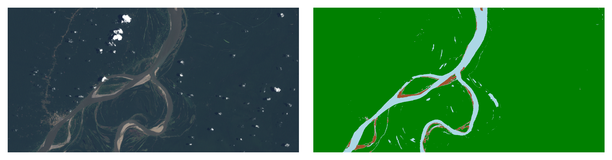
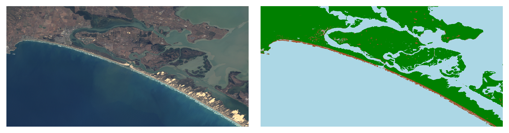

# GlobalGEEWater

GlobalGEEWater offers a tool to detect surface water and sediment in LandSat images, utilizing the high-quality,
manually annotated [RiverPIXELS](https://data.ess-dive.lbl.gov/view/doi:10.15485/1865732) Dataset by LANL scientists.
This project aims to enhance environmental monitoring and research with its precise identification capabilities for
water bodies and sediments globally.

This project provides a demo utilizing [ChatGPT](https://platform.openai.com/docs/overview)
and [Google Earth Engine](https://earthengine.google.com/), designed for easy use on Google Colab. It allows
users to effortlessly obtain and analyze Landsat satellite images for water and sediment pixels of a specified location.

*Ucayali River*

*Murray River*

## Quick Start

### Prerequisites
We recommend using Google Colab for running this demo, as it provides easy access to Google Earth Engine. Before you start, make sure that:
1. Your Google Colab session is connected to your Google Drive.
2. Download data to the folder `RiverPIXELS` from [Shared Google Drive](https://drive.google.com/drive/folders/1yRSjhvQBxjYEHNXOVLc_MNjvZ66cGgHG?usp=sharing)
3. You have created a Google Earth Engine project under the same Google account.
4. Please guarantee your Google Colab support GPU.

### Setting Up
Follow these steps to set up and run the demo:
1. Download this project and place it in your Google Drive under the path `MyDrive/GlobalGEEWater`.
2. Open the project in Google Colab.
3. Modify the `config.yaml` file in the project folder:
   - Change the `GEE_PROJECT` variable to your Google Earth Engine project name.
   - If you want to use the ChatGPT API for automatic selection of Longitude and Latitude values, replace the `OPEN_AI_API_KEY` with your own API key.

### Running the Demo
After setting up, you can use this [Google Colab example](https://colab.research.google.com/drive/10IUg0kr1itfrViOk7ll92rkpO6jFb8V5?usp=sharing) to run the demo.

### Important Hyperparameters

- `--lon_lat` (Type: `str`, Default: `'auto'`): Specifies the longitude and latitude values in the format `"lon, lat"`. Set to `"auto"` to automatically use ChatGPT for determining these values based on the provided location.

- `--location` (Type: `str`, Default: `'Ucayali River'`): Used when `--lon_lat` is set to `"auto"`. It specifies the location's name to fetch its longitude and latitude values automatically.

- `--lon_range` (Type: `float`, Default: `0.25`): Defines the range of longitude to create a rectangle area for analysis. It determines how wide the area around the specified longitude will be considered.

- `--lat_range` (Type: `float`, Default: `0.25`): Similar to `--lon_range`, this parameter sets the range of latitude for the rectangular area of interest, specifying the height of the area around the given latitude.

- `--gee_save_name` (Type: `str`, Default: `'Landsat5_Image'`): Determines the save name of the Google Earth Engine (GEE) image. This name is used for saving and referencing the processed Landsat image within your project.

